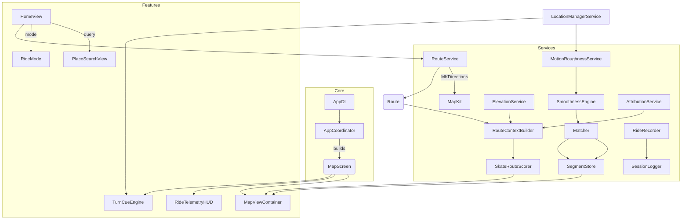

# SkateRoute Whitepaper  
### *All Downhill From Here*

**Document purpose.** This whitepaper presents SkateRoute’s strategic vision and the engineering underpinnings of our skate-first navigation app. It is written for investors, partners, and senior engineers evaluating the product, its defensibility, and its path to scale.

---

## 1) Executive summary

**Problem.** Navigation apps optimize for drivers, cyclists, or pedestrians—not skateboarders. For skaters, **ride feel** matters more than shortest time: surface smoothness, slope/braking risk, crossings density, lane protection, and legal context.

**Solution.** SkateRoute computes routes that *feel great*. It blends MapKit routing with a skate‑aware scorer and renders per‑step overlays that reflect comfort. During a ride, it ingests on‑device motion (RMS roughness), location, and elevation to continuously recolor the line and adapt cues—privacy‑first, no cloud required.

**Why now.** Modern iPhones provide precise motion + GNSS; municipal open data and OSM tags are ubiquitous; and Apple’s privacy primitives enable safe, on‑device learning. The result is a **compounding data asset**: real‑world roughness + grade matched to map segments, improving the model each ride.

**Product status.** A working iOS beta with modular services (routing, elevation, matching, roughness, scoring, overlays, logging), designed for on‑device testing and rapid iteration in the field.

**Strategic moat.**  
- Proprietary **roughness × grade × context** dataset tied to segments.  
- A practical **comfort scorer** that integrates live sensors with mapping.  
- **Community signals** (quick reports + reputation) to bootstrap areas.  

**Call to action.** We seek collaborators for: (1) city data partnerships, (2) supervised rides to seed models, and (3) brand/shop collabs to grow the community.

---

## 2) Product overview

**Primary user journey**
1. Pick **Start** and **Destination** (or “Use my location”).  
2. Choose a **Ride Mode** (Smoothest, Chill Few Crossings, Night Safe, Fast Mild Roughness).  
3. See a candidate route colored by comfort; **braking zones** marked with short dashes.  
4. Tap **Start** to record. Low‑distraction haptics cue upcoming turns; overlays update with live roughness.  
5. End ride; a local log is saved for analysis (and, later, optional upload).

**Core capabilities**
- **Surface‑aware scoring** (roughness RMS + surface reports + crossings proxy).  
- **Slope awareness** (grade sampling + braking detection).  
- **Per‑step overlays** with MapKit renderers (multi‑color + braking dashes).  
- **Turn cues + haptics** (40 m / 15 m).  
- **On‑device logs** for improving the model and validating candidate routes.  

---

## 3) Market view (concise)

- **Audience:** daily commuters, longboarders, filmer crews, and casual cruisers.  
- **Adjacent segments:** inline skaters, scooter riders, wheelchair users seeking smooth surfaces.  
- **Distribution:** organic via skate shops, park signage, local events; later, creator collabs and brand integrations.  
- **Monetization (phased):**  
  1) Free beta to grow telemetry;  
  2) **Pro** tier (offline packs, advanced overlays, session export/GPX);  
  3) **B2B** data/API for city planners and mobility apps (aggregated, privacy‑preserving).  

---

## 4) System architecture

SkateRoute uses a layered, testable structure:

- **Core** – composition, DI, and screen flow.  
- **Features** – SwiftUI screens and UX modules.  
- **Services** – routing, elevation, matching, roughness, scoring, storage, logging.  
- **Support** – utilities for geometry and accuracy profiles.  
- **Resources** – local attribution tiles (e.g., lane proxies, hazards) for seed cities.

### 4.1 Component graph



### 4.2 Runtime data flows

**Planning path**
1. `RouteService` requests `MKDirections` → returns `MKRoute`.  
2. `RouteContextBuilder` samples grade (ElevationService), merges local attributes (AttributionService), emits per‑step metadata.  
3. `SkateRouteScorer` computes a comfort score per step.  
4. `MapViewContainer` renders colored polyline + braking dashes.

**Live ride loop**
- `LocationManagerService` → `MotionRoughnessService` → `SmoothnessEngine (RMS)`  
- `Matcher` snaps samples to nearest step with tolerance; `SegmentStore` updates rolling stats and decays stale values.  
- `MapViewContainer` updates only the visible overlay range.

---

## 5) Algorithms & models

### 5.1 Roughness (on‑device)
- Compute per‑axis acceleration magnitude; high‑pass; RMS over sliding window (e.g., 1.5–2.0 s).  
- **Stability** ~ `1 / (1 + clampedRMS)` for UI responsiveness.  
- Adaptive cadence: downsample when stopped or coasting smoothly.

### 5.2 Grade & braking
- Sample elevation along polyline every 50–100 m; compute `grade = Δelev / distance`.  
- **Braking zones**: contiguous segments with `grade < −6%` across ≥30 m; render as short red dashes.

### 5.3 Map matching
- For each sample `(location, roughnessRMS)`, find nearest route step by polyline proximity; accept if distance < tolerance (e.g., 40 m) to avoid false attribution.

### 5.4 Comfort scoring (per step)
Let:

- `r` = normalized roughness (0 = butter, 1 = crusty)  
- `g` = downhill grade positive magnitude (0…1), `u` = uphill magnitude (0…1)  
- `c` = crossings proxy (normalized step count density)  
- `b` = bike‑lane bonus (0 or 1 proxy)  
- `h` = hazard penalty (0…1 proxy)

**Base score:**  
```
raw = 1
      - w_r * r
      - w_u * u
      + w_g * g
      - w_c * c
      + w_b * b
      - w_h * h
score = clamp(raw, 0, 1)
```

**Ride modes (weight adjustments)**
- *Smoothest:* higher `w_r`, moderate `w_u`, low `w_g`.  
- *Chill Few Crossings:* boost `w_c`.  
- *Night Safe:* add proxy for lighting/arterial penalty; cap `w_g`.  
- *Fast Mild Roughness:* reduce `w_r` by ~40%; increase `w_g`.

Weights are declared in `SkateRouteScorer` and are easily tuned.

### 5.5 Decay & freshness
`SegmentStore` maintains `(meanRoughness, sampleCount, lastSeen)`. A time‑based decay reduces stale influence; new samples quickly update the rolling mean.

---

## 6) Privacy & safety

- **On‑device by default.** Roughness, location, and route attribution remain local unless the rider opts into sharing.  
- **Granular controls.** Hide home/work geofences; delay posting; per‑spot visibility.  
- **Legal reminders.** Skate‑legal awareness will expand per city.  
- **SOS shortcut.** Future one‑tap share of location to a trusted contact.

---

## 7) Performance & reliability

- **Energy budget:** Motion sampling adapts; GPS is paused while stopped; updates coalesce to maintain smooth UI without draining battery.  
- **Renderer efficiency:** Only the visible polyline range is recolored; dashes are pre‑computed masks.  
- **Actor isolation:** Location/motion processing is main‑actor aware where required; asynchronous services keep UI responsive.  
- **Offline:** Elevation and attribute tiles cached; routes persisted for re‑routing without data.

---

## 8) Machine learning roadmap

**Goal:** a learned comfort model that predicts the rider‑preferred path under mode constraints.

- **Training data:** session logs (RMS, speed, grade, step metadata), implicit preference (actual path vs. proposed), and explicit ratings.  
- **Labels:** step‑level comfort (0…1), or pairwise route preference.  
- **Features:** roughness aggregates, slope context, turn acuity, surface class, lane proxy, hazard density, weather flags.  
- **Model:** gradient‑boosted trees for interpretability → distilled to on‑device Core ML.  
- **Privacy:** optional, opt‑in uploads; k‑anonymity and generalization; no raw trajectories published.

---

## 9) Community & moderation

- **Quick reports:** two‑tap “Butter / Okay / Crusty,” plus hazard notes (gravel, wet leaves, metal grates).  
- **Reputation:** trust increase for consistent reporters; decay for stale or disputed claims.  
- **Geofenced “no spot” zones:** schools/hospitals, private property sensitivity.  
- **Shops & parks:** verified profiles to post events, maintenance alerts, discounts for contributions.

---

## 10) Platform extensions

- **Apple Watch:** turn cues and braking warnings via haptics; glanceable HUD.  
- **visionOS:** heads‑up nav banner; line preview before a drop.  
- **Shortcuts/Siri:** “Start Skate Session,” “Find Smooth Line to …”.  
- **Files/Export:** GPX/CSV export for edit and share workflows.

---

## 11) Operations & tooling

- **Session logs:** The recorder prints the saved path on stop (look for `📄 Ride log saved to:` in the Xcode console). CSV/JSON schemas include timestamp, lat/lon, speed, RMS, step index, and flags.  
- **Config:** Build‑time `INFOPLIST_KEY_*` entries for location and background modes; `App-Shared.xcconfig` centralizes Info additions.  
- **Testing:** Unit coverage on scorers and utilities; field tests for overlays and haptics; map‑matching tolerance sweeps.  
- **CI/CD:** Fastlane to run unit tests and build TestFlight; automatic symbol uploads for crash triage.

---

## 12) Go‑to‑market & business

- **Beta focus city:** Start where skate infrastructure is strong; seed with local attributes and shop partners.  
- **Growth loop:** each ride → better segment scores → better routes → more rides.  
- **Monetization:** Pro subscription for offline, advanced overlays, and custom modes; B2B insights for municipal partners (aggregate only).

---

## 13) Risks & mitigations

- **Data sparsity:** bootstrap with attribution tiles + RMS priors; prompt riders to confirm anomalies.  
- **Sensor variance:** calibrate by speed band and device model; use robust statistics.  
- **Legal variance:** maintain a local rules layer and provide legal alternatives.  
- **Battery drain:** adaptive sampling and background minimalism.  
- **False positives in matching:** enforce proximity tolerance and hysteresis.

---

## 14) Milestones

- **Beta 0.1:** On‑device scorer, overlays, logging, start/stop recorder.  
- **Beta 0.2:** Elevation tiles + robust braking marks; route re‑scoring during ride.  
- **Beta 0.3:** Quick reports, reputation seed, offline packs.  
- **Public TestFlight:** expanded cities, shops, seasonal challenges.  
- **1.0 Launch:** subscription + partner APIs.

---

## Appendix A — Module inventory

**Core**  
- `AppCoordinator.swift` — Wires Home → Map and lifecycle.  
- `AppDI.swift` — Dependency container for services and singletons.  
- `AppRouter.swift` — Screen routing helpers.

**Features**  
- Community: `SurfaceRating.swift`, `QuickReportView.swift`.  
- Home: `HomeView.swift`, `HomeViewModel.swift`.  
- Map: `MapScreen.swift`, `MapViewContainer.swift`, `SmoothOverlayRenderer.swift`.  
- Search: `PlaceSearchView.swift`, `PlaceSearchViewModel.swift`.  
- UX: `HapticCue.swift`, `RideMode.swift`, `RideTelemetryHUD.swift`, `SpeedHUDView.swift`, `TurnCueEngine.swift`.

**Services**  
- `AttributionService.swift`, `CacheManager.swift`, `ElevationService.swift`, `GeocoderService.swift`, `LocationManagerService.swift`, `Matcher.swift`, `MatcherTypes.swift`, `MotionRoughnessService.swift`, `RideRecorder.swift`, `RouteContextBuilder.swift`, `RouteService.swift`, `SegmentStore.swift`, `SessionLogger.swift`, `SkateRouteScorer.swift`, `SmoothnessEngine.swift`.

**Support**  
- `AccuracyProfile.swift`, `Geometry.swift`.  
**Resources**  
- `attrs-victoria.json`.

---

## Appendix B — Data dictionary (excerpt)

**Session CSV/JSON fields**
- `ts` (ms), `lat`, `lon`, `speed_mps`, `rms`, `stability`, `step_index`, `grade`, `braking_flag`.  

**SegmentStore key**
- `(route_id, step_index)` → `{ meanRoughness, count, lastSeen, confidence }`.

---

## Appendix C — Local attribute tile (JSON)

```json
{
  "version": 1,
  "city": "Victoria-BC",
  "features": [
    { "polyline_id": "abc123", "bike_lane": true, "hazard": "grates", "turn_severity": 0.2 }
  ]
}
```

---

## Appendix D — Build & privacy configuration

- INFOPLIST_KEY_NSLocationWhenInUseUsageDescription = Downhill Navigator uses your location to find smooth, safe skate routes while you’re using the app.
- INFOPLIST_KEY_NSLocationAlwaysAndWhenInUseUsageDescription = Allows accurate ETAs and continuous guidance with the screen off.
- INFOPLIST_KEY_NSLocationTemporaryUsageDescriptionDictionary_NavigationPrecision = Used briefly to improve route accuracy during active navigation.
- INFOPLIST_KEY_NSMotionUsageDescription = Uses motion sensors to detect surface smoothness while you ride.

## Background updates (required for live tracking & recording)
- INFOPLIST_KEY_UIBackgroundModes = location, processing

## File & analytics logging
- INFOPLIST_KEY_NSFileProtectionComplete = YES
- INFOPLIST_KEY_NSPrivacyAccessedAPICategoryUserDefaults = Accesses user defaults to store preferences and ride data summaries.
- INFOPLIST_KEY_NSPrivacyAccessedAPICategoryFileTimestamp = Uses file system timestamps for ride log management.


All telemetry is on‑device unless explicitly shared.
